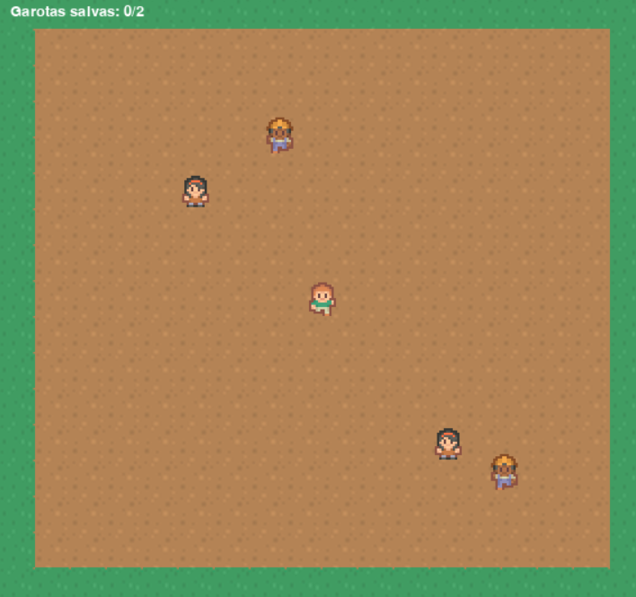

# Urbis
Jogo desenvolvido para o teste prático de Python para novos tutores da Kodland


## Jogo Roguelike 2D

Jogo estilo roguelike 2D onde você deve resgatar garotas desviando dos inimigos.

## Requisitos
- Python 3.6+
- Pygame Zero (pgzero)

### Controles:
- **Setas do teclado** para movimentação

### Como jogar:

1. Clone o repositório:
```bash
git clone https://github.com/MFBouzon/Urbis.git
```
2. Execute o jogo
```bash
pgzrun game.py
```

 
